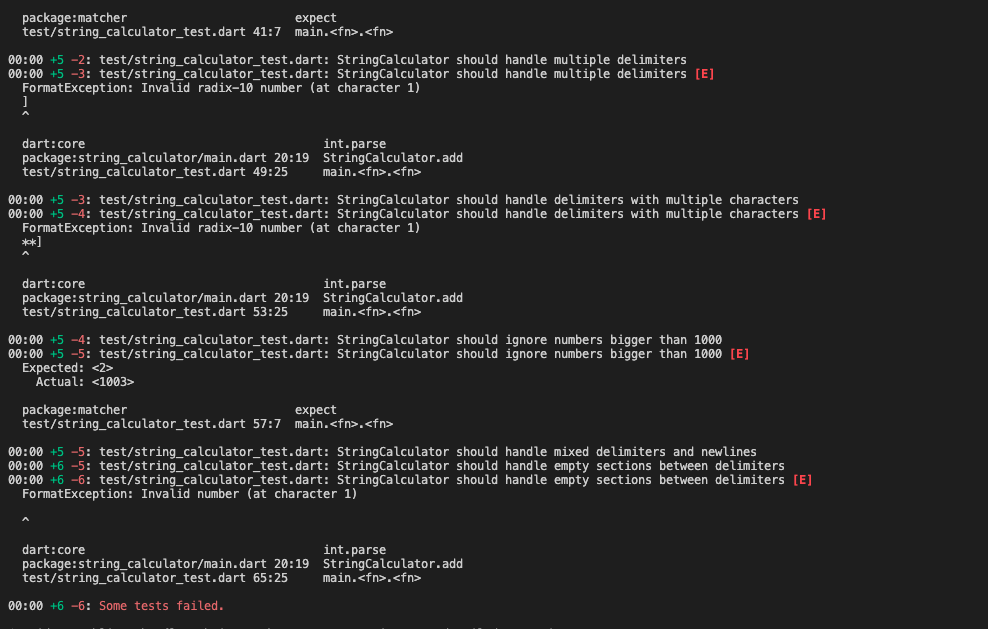
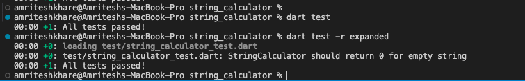

# String Calculator TDD Kata

A Test-Driven Development implementation of a String Calculator in Dart.

## Problem Description

Create a simple String Calculator with a method `add(String numbers)` that takes a string of comma-separated numbers and returns their sum.

### Requirements

1. Empty string returns 0
2. Single number returns its value
3. Two numbers separated by comma returns sum
4. Support for multiple numbers
5. Handle newlines between numbers
6. Support different delimiters
7. Negative numbers throw exception

## Project Structure

```
string_calculator/
├── lib/
│   └── main.dart         # StringCalculator implementation
├── test/
│   └── string_calculator_test.dart  # Test cases
└── pubspec.yaml          # Project dependencies
```

## Setup and Installation

1. Clone the repository:
```bash
git clone https://github.com/yourusername/string_calculator.git
cd string_calculator
```

2. Install dependencies:
```bash
dart pub get
```

## Running Tests

To run all tests:
```bash
dart test
```

For detailed test output:
```bash
dart test -r expanded
```

## Implementation Details

### Test Cases
1. **Basic Tests**
   - Empty string returns 0
   - Single number returns value
   - Two numbers return sum

2. **Advanced Features**
   - Multiple numbers
   - Newline handling
   - Custom delimiters
   - Negative number validation

### Test Results

<details>
<summary>Click to see test results</summary>

```
[Screenshot of test results will go here]
```

</details>

## TDD Process Screenshots

### 1. Red Phase (Failing Test)


### 2. Green Phase (Passing Test)



## Development Process

This project strictly follows Test-Driven Development principles:
1. ✍️ Write a failing test
2. ✅ Write minimal code to pass
3. 🔄 Refactor
4. 🔁 Repeat

## Contributing

1. Fork the repository
2. Create your feature branch
3. Commit your changes
4. Push to the branch
5. Create a Pull Request

## License

This project is licensed under the MIT License - see the [LICENSE](LICENSE) file for details.

## Author

[Your Name]

## Acknowledgments

- Incubyte for the TDD kata challenge
- Dart community for the testing framework


