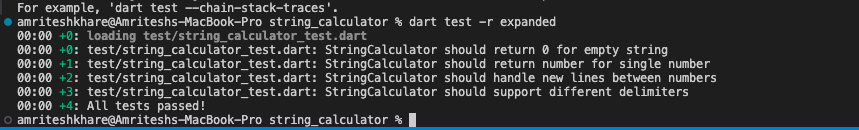
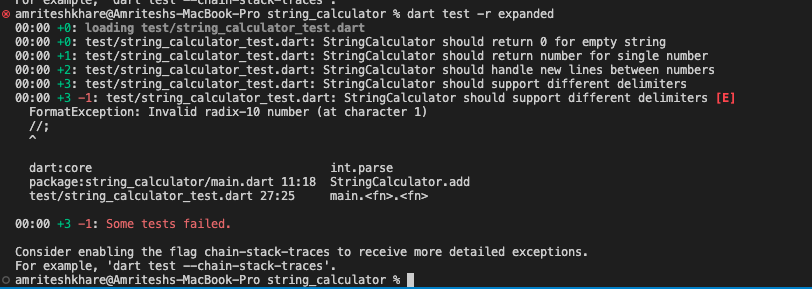

# String Calculator TDD Kata

## Introduction

This project is an implementation of the String Calculator TDD Kata, completed as part of a technical assessment for Incubyte. The goal was to demonstrate proficiency in Test-Driven Development (TDD) and showcase clean, well-tested code.

The project adheres strictly to TDD principles, with each feature developed through a cycle of writing a failing test, implementing the minimal code to pass the test, and then refactoring. The commit history reflects this process, with frequent commits showing the evolution of the code with each step of TDD.

## Problem Description

Create a simple String Calculator with a method `add(String numbers)` that takes a string of comma-separated numbers and returns their sum.

### Requirements

1. Empty string returns 0
2. Single number returns its value
3. Two numbers separated by comma returns sum
4. Support for multiple numbers
5. Handle newlines between numbers
6. Support different delimiters
7. Negative numbers throw exception

## Project Structure


```
string_calculator/
├── lib/
│   └── main.dart         # StringCalculator implementation
├── test/
│   └── string_calculator_test.dart  # Test cases
└── pubspec.yaml          # Project dependencies
```

## Setup and Installation

1. Clone the repository:
```bash
git clone https://github.com/AmriteshTrikon/string_calculator.git
cd string_calculator
```

2. Install dependencies:
```bash
dart pub get
```

## Running Tests

To run all tests:
```bash
dart test
```

For detailed test output:
```bash
dart test -r expanded
```

## Implementation Details

### Test Cases
1. **Basic Tests**
   - Empty string returns 0
   - Single number returns value
   - Two numbers return sum

2. **Advanced Features**
   - Multiple numbers
   - Newline handling
   - Custom delimiters
   - Negative number validation

### Test Results

<details>
<summary>Click to see test results</summary>

```
[https://drive.google.com/drive/folders/1WiSnktN_ZJ_sY_-QpEQm_V5hjwxGMoHA?usp=sharing]
```

</details>

## TDD Process Screenshots

### 1. Red Phase (Failing Test)


### 2. Green Phase (Passing Test)


### 2. Each Testcase(Passing Test)






## Development Process

This project strictly follows Test-Driven Development principles:
1. ✍️ Write a failing test
2. ✅ Write minimal code to pass
3. 🔄 Refactor
4. 🔁 Repeat


## Author

Amritesh Khare

## Acknowledgments

- Incubyte for the TDD kata challenge
- Dart community for the testing framework


